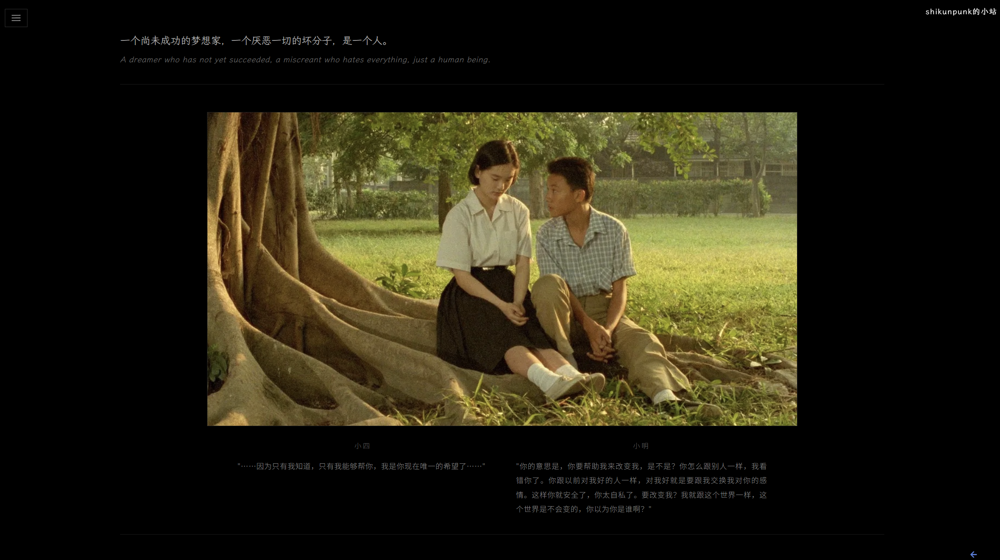

# Shikunpunk 的大脑 — 实施计划 v4（Kimi K3 执行版·终稿）

#原始提示词

这样我现在设计一个个人站需要你检查并修改我的计划，
首页刚进入的时候只有一个下拉式的台灯开关一切都是黑的，然后我们点击这个这开关，开关下拉一下，白织灯照亮了这里，一个没有别拉开的窗帘，跟着窗帘有些字逐渐出现：
大的，粗的，醒目的，从上到下。
这里是shikunpunk的大脑
你可以感受他的感受
关心他的关心
幻想他的幻想
通过一些方式你可以拉开窗帘，你可以看到一面挂面窗子的墙（像网格状的整齐摆放），墙上的窗子像画。每个窗子都是他的作品网站首页的截图，下面都有一行字介绍：名称，简介。
往下滑动，我们可以看到一个书桌，书桌上摆满了草稿和纸张，每个一个都是他曾经解决过的题目。
滑动到底部我们可以看到它的联系方式和社交媒体：
给我一个完整的方案，我们便于用kimi k3实现的，最佳效果。

窗墙之前需要再加一个场景，通过点击到这个场景：
shikunpunk的想法和疑问，艺术性的出现，但是要从上到下。
人类终将毁灭于TA们自己吗？
人工智能是第四次工业革命。
为什么这么多的人只是甘于顺从和模仿，而不是独立和创造？
你喜欢思考吗，你爱这个世界吗？
我讨厌庸俗和庸俗的人。
怎么样我们才能越过偏见，相互尊重，我们能相爱吗？
人性是对动物性的超越。
这个世界上虚伪多还是诚实多？
我能够通过科学理解猫的语言吗，人和其他动物并非不可相互沟通。
我能通过数学概括每一株植物生长的形状吗，从而形成一种对美的抽象吗？

> 本文件为最终交付规格书，可直接作为 Kimi K3 的输入 prompt。
> 基于 v3 + 作者 2026-07-28 二次修改整合而成。
> 产物：`index.html` + `screenshots/` 文件夹，部署到 Vercel。

---

## 0. 全局约束

- **文件结构**（v4 调整：不再单文件）：
  ```
  e:\简历\
  ├── index.html              # 主页面（CSS/JS 内嵌）
  ├── screenshots/            # 18 张截图（见 screenshots/README.md）
  │   ├── work_a_blog.jpg
  │   ├── ... (共 10 张作品截图)
  │   └── paper_1_sprt.jpg
  │       ... (共 8 张论文截图)
  └── 计划_v4.md              # 本文件
  ```
- **外部 CDN**（必须使用以下链接）：
  - GSAP: `https://cdnjs.cloudflare.com/ajax/libs/gsap/3.12.5/gsap.min.js`
  - ScrollTrigger: `https://cdnjs.cloudflare.com/ajax/libs/gsap/3.12.5/ScrollTrigger.min.js`
  - Font Awesome 6: `https://cdnjs.cloudflare.com/ajax/libs/font-awesome/6.5.1/css/all.min.css`
  - Google Fonts: `Space Grotesk`（400/500/700/800）、`Cormorant Garamond`（300/400 斜体）、`Caveat`（手写）
- **浏览器**：Chrome / Safari 最新版 + 移动端 768px 断点适配
- **滚动**：`html { scroll-behavior: smooth; }`
- **中文注释**：关键 JS 逻辑、时间线、ScrollTrigger 配置必须有中文注释
- **无 loading 进度条**，无 `prefers-reduced-motion` 强制处理（保持沉浸感）
- **签名统一**：`shikunpunk`；GitHub 用户名为 `shikunpneg`（**非拼写错误，勿改**）

## 1. 设计令牌（CSS 变量集中定义）

```css
:root {
  --bg-black: #0a0a0a;
  --light-warm: #fff4e6;
  --wood-light: #3a2c1b;
  --wood-dark: #2a1e12;
  --frame-metal-1: #2a2a2a;
  --frame-metal-2: #444;
  --text-main: #f0ece4;
  --text-warm-gray: #d4c9b8;
  --thought-bg: #141210; /* 场景3略暗暖灰 */
  --curtain-color: #6b3a1f; /* 暖色厚窗帘 */
}
```

## 2. 场景流程总览

| 序号 | 名称 | 视口 | 触发方式 |
| --- | --- | --- | --- |
| 1 | 黑暗入口 | 100vh | 点击拉绳 |
| 2 | 窗帘与浮现文字 | 100vh | **8 秒后自动进入场景 3** |
| 3 | 思想之墙 | 100vh | **拉绳关灯 → 开灯进入场景 4** |
| 4 | 窗墙·作品集 | 120vh | ScrollTrigger |
| 5 | 书桌·论文俯瞰 | 80vh | ScrollTrigger |
| 6 | 底部·联系方式 | 30vh | ScrollTrigger |

---

## 3. 场景 1：黑暗入口

- 全屏 `var(--bg-black)`，中央偏下 SVG 拉绳开关
- 拉绳 = 细线（`width: 2px`，渐变金属色）+ 末端小圆环（`border-radius: 50%`）
- 点击圆环 → GSAP 时间线 2.5s：
  1. 拉绳 `y: +20` → 回弹 `y: 0`（`ease: elastic.out(1, 0.5)`）
  2. 圆环处闪白光点（`box-shadow` 爆裂 0.2s）
  3. 全屏覆盖层 `radial-gradient(circle at center, rgba(255,244,230,0.15) 0%, rgba(10,10,10,0.95) 80%)`，`opacity 0 → 1`
  4. 背景从 `#0a0a0a` 过渡到 `#1a1612`
- 时间线结束 → 自动淡入场景 2

## 4. 场景 2：窗帘与浮现文字

- **窗帘形态**（v4 重新设计）：
  - **从下往上拉开的幕布式**，像剧院开幕、像家里厚重的暖色窗帘被向上卷起
  - 整块窗帘占满屏幕，初始覆盖全屏
  - 窗帘颜色：暖色厚重织物 `var(--curtain-color)`，带垂直褶皱纹理（多层 `linear-gradient` 模拟）
  - 窗帘顶部有木质横杆（`box-shadow` 立体感）
  - 文字浮现完成后，窗帘从下边缘开始向上卷起（GSAP `clip-path: inset(0 0 100% 0)` → `inset(0 0 0 0)` 或 `transform: scaleY(0)` `transform-origin: bottom`）
- 文字逐行浮现（每行间隔 0.4s，`opacity 0→1` + `y 20→0`，`ease: power2.out`）：

| 序号 | 内容 | 样式 |
| --- | --- | --- |
| 1 | 这里是 | 1rem，`Cormorant Garamond` 斜体，字间距 0.3em |
| 2 | SHIKUNPUNK | `clamp(4rem, 15vw, 10rem)`，`Space Grotesk` 800，字间距 -0.02em |
| 3 | 的大脑 | 2rem，`Space Grotesk` 500 |
| 4 | 你可以感受他的感受 | 1.2rem，字重 300 |
| 5 | 关心他的关心 | 1.2rem，字重 300 |
| 6 | 幻想他的幻想 | 1.2rem，字重 300，`Cormorant Garamond` 斜体 |

- **v4 改动**：**无按钮**。文字全部浮现后，停 8 秒，窗帘自动从下往上卷起，过渡到场景 3
- GSAP 时间线：`文字浮现 → delay(8) → 窗帘上卷(1.5s) → 进入场景 3`

## 5. 场景 3：思想之墙

- 背景 `var(--thought-bg)`，纯文字瀑布
- **删除原计划前两句"shikunpunk 的""想法与疑问"，直接从正文开始**
- GSAP 时间线，每句间隔 0.5-0.8s，居中对齐，`opacity 0→1` + `y 30→0`
- 偶数句用 `var(--text-warm-gray)` 形成节奏

| 序号 | 内容 | 样式 |
| --- | --- | --- |
| 1 | 人类终将毁灭于TA们自己吗？ | 1.4rem，斜体，暖灰 |
| 2 | 人工智能是第四次工业革命。 | 1.4rem，正体 |
| 3 | 为什么这么多的人只是甘于顺从和模仿，而不是独立和创造？ | 1.4rem，行距 1.8 |
| 4 | 你喜欢思考吗，你爱这个世界吗？ | 1.4rem，斜体，暖灰 |
| 5 | 我讨厌庸俗和庸俗的人。 | 1.4rem，字重 500 |
| 6 | 怎么样我们才能越过偏见，相互尊重，我们能相爱吗？ | 1.4rem |
| 7 | 人性是对动物性的超越。 | 1.4rem，斜体，暖灰 |
| 8 | 这个世界上虚伪多还是诚实多？ | 1.4rem |
| 9 | 我能够通过科学理解猫的语言吗，人和其他动物并非不可相互沟通。 | 1.4rem，字重 300，行距 1.8 |
| 10 | 我能通过数学概括每一株植物生长的形状吗，从而形成一种对美的抽象吗？ | 1.4rem，字重 300，斜体 |

- **v4 改动（关键交互）**：全部文字出现后，**场景底部出现第二条拉绳开关**（与场景 1 同款）
- 用户拉绳 → **关灯**（全屏 `#0a0a0a` `opacity 0→1`，0.8s）→ 黑屏 0.5s → **开灯**（`opacity 1→0`，0.8s，背景已切到场景 4 的窗墙）→ 进入场景 4
- 符合生活场景：拉绳 = 灯开关，拉一下关灯，再拉一下开灯，场景在黑暗中切换

## 6. 场景 4：窗墙·作品集（10 个作品）

- 3 列网格，10 个作品（3+3+3+1 布局，最后一行 1 个居中）
- 每扇窗户：8px 厚窗框（`box-shadow` 内阴影模拟立体感 + 玻璃质感 `linear-gradient` 高光）
- **窗内画面 = 作品首页截图**（v4 改动，非 CSS 绘制）
- 悬停：`transform: perspective(800px) translateZ(20px) scale(1.03)`，0.4s
- **点击 = 新窗口打开真实链接**（`window.open(url, '_blank')`）
- ScrollTrigger 触发窗户逐个渐入（`stagger: 0.1`，`y: 50→0`）

### 6.1 作品清单与截图文件名

| # | 标题 | 简介 | 链接 | 截图文件名 |
| --- | --- | --- | --- | --- |
| A | shikunpunk 的小站 | 静态博客，记录笔记与技术文章 | `https://www.shikunpunk.fun` | `screenshots/work_a_blog.jpg` |
| B | 世界杯预测器 | 一个预测世界杯的模型 | `http://8.148.66.127:8000/` | `screenshots/work_b_worldcup.jpg` |
| C | fast-read-book | 利用知识图谱快速重构图书的轻便工具 | `https://github.com/shikunpneg/fast_read_book` | `screenshots/work_c_fastread.jpg` |
| D | xhs-rag | 基于小红书博主内容的 RAG 个性化检索系统 | `https://github.com/shikunpneg/xhs-rag` | `screenshots/work_d_xhsrag.jpg` |
| E | see-quantum world | 可视化交互的量子知识学习网站 | `https://quantum-viz-chi.vercel.app/` | `screenshots/work_e_quantum.jpg` |
| F | 暗夜主题 | 2023 UI/UX | `#`（无链接，弹自定义浮层提示"详情待补"） | `screenshots/work_f_darktheme.jpg` |
| 7 | 向山朝圣知音湖上的水怪 | 2024FIRST主动放映·长江大学（武汉校区）·现场执行 | `https://mp.weixin.qq.com/s/cSIiHJAOEB9IuwpWdjMECg` | `screenshots/work_7_mountain.jpg` |
| 8 | 未来 母亲 | 2025FIRST主动放映·长江大学站·策展人 | `https://www.xiaohongshu.com/explore/6823a46e0000000023013e06?xsec_token=ABLQg99l13aUUTlzQo08RdUIabOtHKMKJzWO2n3Ku6qzY=&xsec_source=pc_user` | `screenshots/work_8_futuremother.jpg` |
| 9 | 我 返回 故乡 | 2026FIRST主动放映·光之影放映计划站·策展人 | `https://www.xiaohongshu.com/explore/69cfe03d0000000022001536?xsec_token=ABhJbooRhpMd91p7oeKZLvcT_CJA8cN8L6O4IZbxKG3s4=&xsec_source=pc_user` | `screenshots/work_9_hometown.jpg` |
| 10 | 穿过他者的凝视 | ANNFFF 动物未来生态电影展·荆州站·策展人 | `https://mp.weixin.qq.com/s/ke4PorDv3xH1K5dHBp1-OQ` | `screenshots/work_10_gaze.jpg` |

### 6.2 窗户卡片 HTML 结构

```html
<a class="window-card" data-url="真实链接" href="javascript:void(0)">
  <div class="window-frame">
    
  </div>
  <div class="window-caption">
    <div class="title">shikunpunk 的小站</div>
    <div class="desc">静态博客，记录笔记与技术文章</div>
  </div>
</a>
```

点击事件统一委托：
```js
document.querySelectorAll('.window-card').forEach(el => {
  el.addEventListener('click', () => {
    const url = el.dataset.url;
    if (url && url !== '#') window.open(url, '_blank');
    else showToast('详情待补'); // 作品 F 的处理
  });
});
```

## 7. 场景 5：书桌·论文俯瞰

- **俯瞰视角**（top-down）：木质桌面铺满屏幕，木纹用多层 `linear-gradient` 叠加噪点
- 桌面边缘有轻微阴影暗角（`box-shadow: inset`）
- 8 张论文草稿纸**散落摆放**，`position: absolute`，每张 `rotate(-8deg ~ 8deg)` 随机
- 草稿纸 = 米白纸张（`#f4ede0`）+ 微噪点 + 卷曲边角阴影
- **纸上内容**（v4 改动）：
  - 手写字体 `Caveat` 写论文标题 + 年份
  - **纸张主体展示论文首页截图**（非小图示，非 CSS 绘制）
  - 截图以略倾斜角度贴在纸上，模拟"打印出来贴在桌面"的效果
- **点击纸张** → 该纸张上浮放大居中（`transform: translate(-50%,-50%) scale(1.5) rotate(0)`），其他纸张半透明虚化，再次点击关闭
- ScrollTrigger 触发纸张从屏幕外飞入（`stagger: 0.15`，`y: 100, opacity: 0`）

### 7.1 论文清单（8 张，全部来自真实素材）

| # | 标题（手写体） | 年份 | 截图文件名 |
| --- | --- | --- | --- |
| 1 | 序贯概率比下的生产决策最优规划模型 | 2023 | `screenshots/paper_1_sprt.jpg` |
| 2 | 行车轨迹估计红绿灯周期 | 2024 | `screenshots/paper_2_traffic.jpg` |
| 3 | 粒子群峰算法·红外干涉光谱外延层厚度测量 | 2025 | `screenshots/paper_3_infrared.jpg` |
| 4 | 圆柱镜反射变形艺术中的图形变换 | 2026 | `screenshots/paper_4_cylmirror.jpg` |
| 5 | QGRU 量子门控循环单元·青少年压力预测 | 2026 | `screenshots/paper_5_qgru.jpg` |
| 6 | 本源杯 originqcup 量子计算 | 2026 | `screenshots/paper_6_originq.jpg` |
| 7 | MCM C 题·DWTS 火热背后的数学奥秘 | 2026 | `screenshots/paper_7_mcm.jpg` |
| 8 | CCKS·知识图谱与 LLM 推理 | 2026 | `screenshots/paper_8_ccks.jpg` |

## 8. 场景 6：底部·联系方式

- 背景 `var(--thought-bg)`
- 手写签名 "— shikunpunk"（`Caveat`，3rem，`var(--text-main)`）
- 下方一行社交图标（横向居中，间距 2rem）：

| 平台 | 图标方案 | 链接 |
| --- | --- | --- |
| GitHub | `<i class="fa-brands fa-github"></i>` | `https://github.com/shikunpneg` |
| 邮箱 1 (Gmail) | `<i class="fa-solid fa-envelope"></i>` | `mailto:ok2442504@gmail.com` |
| 邮箱 2 (QQ) | `<i class="fa-solid fa-envelope"></i>`（颜色区分，hover 提示 QQ） | `mailto:skpskpskp@qq.com` |
| 小红书 | **自定义 SVG**（红色圆底 + "红"字或简化书形） | `https://www.xiaohongshu.com/user/profile/65a7570000000000080155f7?xsec_token=AB21cOBwNMX8vNnva_KkY61ds0meFeUIV71CfUeV_lAZM%3D&xsec_source=pc_search` |
| X / Twitter | `<i class="fa-brands fa-x-twitter"></i>` | `#`（占位，无真实账号） |

- 图标悬停：`scale(1.2)` + 暖光 `text-shadow`
- 页脚一行小字："© 2026 shikunpunk · 走进我的大脑"

## 9. 全局过渡与滚动

- **场景 1→2**：拉绳点击 → 光晕扩散 → 自动进入
- **场景 2→3**（v4 改动）：无按钮，文字浮现后停 8 秒 → 窗帘从下往上卷起 → 进入场景 3
- **场景 3→4**（v4 改动）：底部拉绳 → 关灯黑屏 → 开灯已到场景 4
- **场景 4→5→6**：ScrollTrigger 驱动，`start: top 80%`，`toggleActions: play none none reverse`
- 场景间背景色用 GSAP `to` 平滑过渡 `--bg` 变量
- 移动端 768px：窗户改 2 列，草稿纸改 4 张可见可滚动，字号统一 `clamp` 缩放

## 10. JS 关键模块（必须有中文注释）

```js
// 1. 场景管理器：记录当前场景，控制关灯/开灯过渡
// 2. 拉绳点击时间线（场景1 开灯 / 场景3 关灯→开灯）
// 3. 文字浮现时间线（场景2、3）+ 场景2 的 8 秒延时与窗帘上卷
// 4. 窗墙 ScrollTrigger 渐入 + 点击新窗口打开链接
// 5. 书桌俯瞰：纸张飞入 + 点击放大查看论文截图
// 6. 移动端适配：根据 innerWidth 切换布局
```

---

## 11. Git 仓库上传（v4 新增）

### 11.1 仓库初始化

```bash
# 在 e:\简历 目录下执行
git init
git branch -M main
```

### 11.2 创建 `.gitignore`

```
# 临时文件
*.tmp
*.log
.DS_Store
Thumbs.db

# 旧版本计划文件（可选保留）
# 计划.md
# 计划_v2.md
# 计划_v3.md

# 大文件备份（不进仓库）
*.pdf
resume.pdf
resume1.pdf
```

### 11.3 首次提交与推送

```bash
# 1. 在 GitHub 网页端创建空仓库（不要勾选 README）
#    仓库名建议：shikunpunk-brain
#    地址：https://github.com/shikunpneg/shikunpunk-brain

# 2. 本地关联远程
git remote add origin https://github.com/shikunpneg/shikunpunk-brain.git

# 3. 添加文件（注意排除 PDF 等大文件）
git add index.html screenshots/ 计划_v4.md .gitignore
git commit -m "feat: 初始化 Shikunpunk 的大脑沉浸式个人站

- 6 场景叙事：黑暗入口 → 窗帘文字 → 思想之墙 → 窗墙作品 → 书桌论文 → 联系方式
- 10 个作品窗户 + 8 张论文草稿纸
- GSAP + ScrollTrigger 动画驱动
- 关灯/开灯场景过渡"

# 4. 推送
git push -u origin main
```

### 11.4 后续更新流程

```bash
git add .
git commit -m "update: 修改描述"
git push
```

---

## 12. Vercel 部署（v4 新增）

### 12.1 部署步骤

1. 访问 https://vercel.com → 用 GitHub 账号登录
2. 点 `Add New...` → `Project` → 找到 `shikunpunk-brain` 仓库 → `Import`
3. 配置（关键）：
   - **Framework Preset**: `Other`（纯静态站点）
   - **Build Command**: 留空（无需构建）
   - **Output Directory**: `.`（当前目录）
   - **Install Command**: 留空
4. 点 `Deploy` → 等待 30 秒 → 部署完成
5. 获得 Vercel 默认域名：`shikunpunk-brain.vercel.app`

### 12.2 绑定自定义域名

> 你已有 `shikunpunk.fun`（作品 A 的博客），此站建议用子域名 `brain.shikunpunk.fun`

1. Vercel 项目 → `Settings` → `Domains` → `Add Domain`
2. 输入 `brain.shikunpunk.fun` → `Add`
3. 到域名 DNS 管理后台（你在哪买的域名就去哪）添加解析：
   - **类型**：`CNAME`
   - **主机记录**：`brain`
   - **记录值**：`cname.vercel-dns.com`
4. 等 DNS 生效（5-30 分钟）→ Vercel 自动签发 HTTPS 证书
5. 访问 `https://brain.shikunpunk.fun` 验证

### 12.3 自动部署

- 之后每次 `git push` 到 `main` 分支，Vercel 自动触发部署
- 部署日志在 Vercel 控制台查看

---

## 13. 预算估算（v4 新增）

### 13.1 一次性成本

| 项目 | 费用 | 说明 |
| --- | --- | --- |
| 域名 `shikunpunk.fun` | ¥0（已购） | 作品 A 已使用，复用子域名 |
| GitHub 仓库 | ¥0 | 免费私有/公开仓库 |
| Vercel 部署 | ¥0 | Hobby 免费版足够（100GB 流量/月） |
| 截图工具 | ¥0 | 浏览器/PDF 阅读器自带 |
| CDN（GSAP/FontAwesome/Google Fonts） | ¥0 | cdnjs 与 Google Fonts 免费 |
| **小计** | **¥0** | |

### 13.2 持续成本（年）

| 项目 | 费用 | 说明 |
| --- | --- | --- |
| 域名续费 | ¥30-80/年 | .fun 域名续费价 |
| Vercel | ¥0 | 免费版对个人站足够 |
| **小计** | **¥30-80/年** | |

### 13.3 预算风险提示

- Vercel 免费版限制：100GB/月带宽、100GB-Hours/月 Serverless。个人站远达不到。
- 若未来流量爆发（>100GB/月），升级 Vercel Pro：$20/月
- 若需要更多自定义域名，免费版支持 50 个，足够用
- **结论：本项目首年 0 元，后续每年约 30-80 元域名续费**

---

## 14. 验收清单

- [ ] `index.html` + `screenshots/` 文件夹齐全，双击 `index.html` 可运行
- [ ] 18 张截图按命名规范放置（见 `screenshots/README.md`）
- [ ] 6 个场景顺序正确，过渡流畅
- [ ] 场景 2 窗帘从下往上卷起，无按钮，8 秒自动进入
- [ ] 场景 3→4 通过拉绳关灯/开灯过渡
- [ ] 10 个窗户均显示真实截图，点击打开真实链接
- [ ] 8 张论文草稿纸俯瞰摆放，显示论文首页截图，点击放大
- [ ] 5 个社交图标（含小红书 SVG），链接正确
- [ ] 移动端 768px 基本可用
- [ ] 关键 JS 有中文注释
- [ ] 无 console 报错
- [ ] 已推送至 GitHub 仓库 `shikunpneg/shikunpunk-brain`
- [ ] 已部署至 Vercel，可通过 `brain.shikunpunk.fun` 访问
- [ ] HTTPS 证书生效

---

## 15. 待你准备的事项

1. **截图（18 张）**：按 `screenshots/README.md` 命名规范放入 `e:\简历\screenshots\`
   - 10 张作品截图：访问对应 URL 截图
   - 8 张论文截图：打开本地 PDF 截首页
2. **GitHub 仓库**：在 https://github.com/new 创建 `shikunpunk-brain` 空仓库
3. **域名 DNS**：在域名管理后台添加 `brain` 的 CNAME 解析（部署后再加也行）
4. **Kimi K3 生成 HTML**：用 v4 计划作为 prompt，让 Kimi 输出 `index.html`
